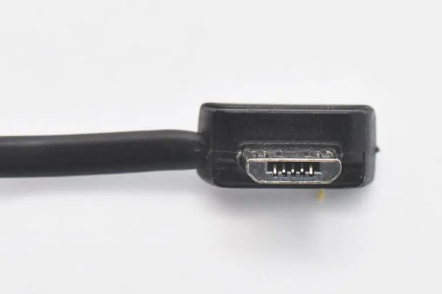

# python嵌入式攻略

嵌入式开发指的是为特定硬件开发功能,比如给冰箱加个屏幕来控制内部冷冻室冷藏室的温度,比如控制四轴无人机可以正常飞行等.很明显的这种开发和为传统个人电脑或者服务器开发软件完全不同.一直以来都是C语言和汇编语言的传统阵地.

随着硬件的发展嵌入式硬件性能也越来越强大,现在python也可以用于嵌入式开发了.

## python做嵌入式开发的定位

能做并不代表能做的最好,python作为一种脚本语言,做嵌入式开发是有天然劣势的:

1. 依赖一个虚拟机,总归会比较吃flashroom的空间
2. 指令经过转译,会损失性能
3. 对象结构复杂,会更吃运存

因此python做嵌入式开发的定位应该可以总结为:

1. 作为教学语言学习基本的嵌入式知识
2. 用来做原型和快速迭代产品

本文也是建立在这一定位上的产物.

## 嵌入式开发的特殊性

嵌入式开发不同于在通用电脑或者服务器上开发.

嵌入式,一般是指嵌入式系统,英文叫作'embeddedsystem'.嵌入式开发其实就是对嵌入式系统的开发.

所谓嵌入式系统是以应用为中心,以计算机为技术核心,面向用户,面向产品,面向应用,软硬件可裁减的,适用于对功能,可靠性,成本,体积,功耗等综合性能有严格要求的专用计算机系统.

以应用为中心,说明嵌入式系统是有明确实际用途的;以计算机技术为基础,说明它其实就是一种特殊的计算机;软硬件可裁剪,说明它有很强的灵活性和可定制能力.

讲人话就是嵌入式开发开发的是自带应用的系统而非通用系统之上的应用.

嵌入式开发会面临很多在用电脑或者服务器上不会存在的问题:

1. 计算资源窘迫,通常嵌入式系统能调用的运存以k为单位,大一点的也就几m,闪存也就几m最多十几m,这和通用电脑或者服务器完全无法相比,cpu算力也是完全无法相提并论.
2. 处理器架构不同,一般都是使用的精简指令集(RISC),通常不会超过32位系统,比如stm32很多型号使用armv7-M架构,esp32是xtensa架构,esp32-c3是RISC-V架构.这和通用电脑或者服务器常用的x86_amd64以及AArch64不同.这就让我们无法直接移植程序到嵌入式设备,不得不通过交叉编译得到目标硬件可以执行的程序然后烧录进目标硬件.
3. 程序开机就启动,由于自己就是系统,所以一旦开机通电,嵌入式程序就会被执行起来.因此自然也就没有什么环境问题,环境就是硬件.
4. 需要考虑能源问题.嵌入式设备很多时候是靠电池驱动的,我们必须考虑如何合理利用那么点电让设备尽量用的久,这让省电节能成了真真切切的要求而非环保口号.
5. 输入输出需要根据功能挑选.一个嵌入式设备通常没有屏幕,没有键盘鼠标,输入可能是各种传感器,输出可能是蜂鸣器,led灯.这需要我们自行设计挑选.
6. 需要自己设计电路.除了要自己挑选输入输出,通常我们还得设计电路把输入输出,供电,芯片都串起来.

## 本文使用的芯片介绍

可以跑python的嵌入式芯片并不算多,但好在基本算是领域中的佼佼者.

本文使用的芯片有3款

+ esp8622,自带wifi功能的芯片,便宜,够用,一块芯片15块rmb左右,开发板也不过50,60元rmb,io接口偏少但也基本够用.适合几乎所有终端位置和一些简单的逻辑控制场景

+ esp32,esp8622的上位版本,自带蓝牙和wifi功能的芯片,功能强大价钱便宜,一块芯片20多rmb,开发板也不过50,60元rmb,io接口偏少但也基本够用.适合在功能略微复杂,需要蓝牙的场景,或者有简单ai模型计算的场景下使用.
+ esp32-S3,esp32的上位版本,自带蓝牙和wifi功能的芯片,更强的性能更大的运存和闪存,闪存最大可以到16m,可以支持较大的ai模型,当然价钱也上来了,不过依然不算贵,开发板也不过就100块rmb左右,适合作为简单边缘计算的节点.

这三款芯片都来自国产品牌[乐鑫科技(科创板:688018)](https://www.espressif.com.cn/zh-hans).他们架构接近,sdk也接近,用法也接近,而且自带网络功能.便宜又好用,早已远销海外,堪称国货之光.

我使用的是他们的开发板进行演示和学习.如果感兴趣可以自己买一块回来玩玩.

## 本文中实验需要的其他设备

本文会有大量例子,不同的例子可能需要的设备元件并不完全一样,但有一些基础的实验设备是必不可少的.下面是阅读本文的最小化清单.

+ microusb连接线,开发板的供电和刷机都用得到,只需要有一头是microusb的公头即可,另一头视你的电脑接口而定

    

+ 面包板,一种免焊接电路原型实验板,调试验证使用的基础板子,除了高频电路外都可以使用,无需焊接,元件可重复使用.面包板分左中右三个区域,左右两个区域竖着的每一排是连通的,中间区域又分为左右两边,每边横着五排,每边横向的5个点是连通的
  
    

+ 杜邦线,和面包板搭配的调试用线材,公头可以插进面包板,母头可以连接有引脚的芯片,最好两头公头的和一公一母的都买点
+ 电阻,电容,电杆,发光二极管等,电路的基础组件如果家里一点没有可以买各个品牌的样品册,如果以前折腾过树莓派啥的可以等到缺元件了再买
+ 数控电源,提供相对稳定特定低压供电的设备,esp8266需要3.3v电压,推荐500mA电流以上;esp32需要3.3v或5v电压,最低工作电流5µA,平均电流约为80 mA,最大电流500 mA.

